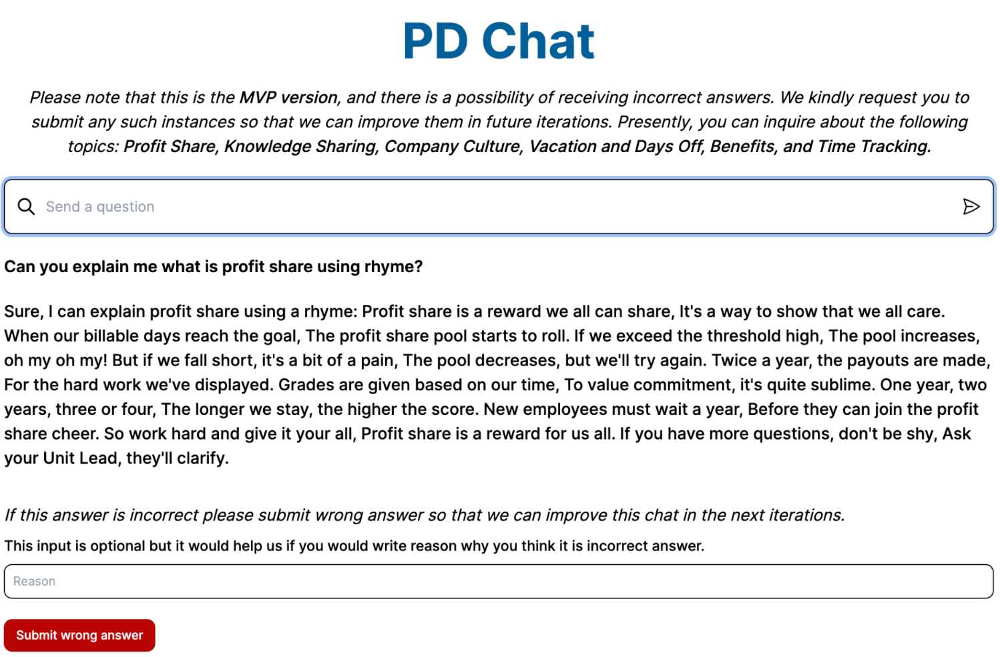

## Getting Started

AI powered chat.


### Setup

Create an account on [OpenAI](https://openai.com) to get API key

Create an account on [Supabase](https://supabase.com) to get API keys

Next create `.env` file and add API keys

### Starting development server:

```bash
npm install

npm run dev
```

### Supabase

[Supabase CLI docs](https://supabase.com/docs/reference/cli/global-flags)

Steps:

1. Install supabase CLI on your machine
2. Execute following commands

```shell
supabase init
supabase login
supabase link --project-ref <project-ref>
```

If you have issues with connecting to Docker this will help - (https://eshlox.net/2023/02/26/supabase-cli-cannot-connect-to-the-docker-daemon/)

[To create next migration](https://supabase.com/docs/reference/cli/supabase-migration-new)